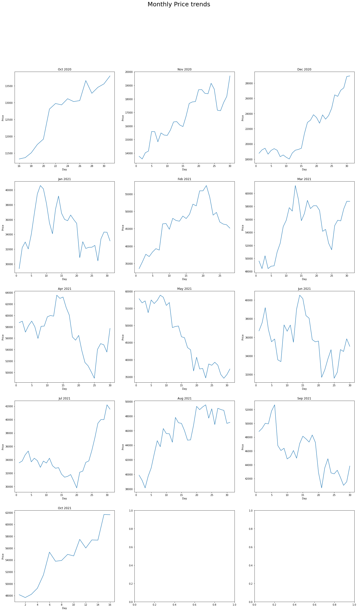

# Using-Bitcoin-Pricing-Data-to-Create-a-ProfitableAlgorithmic-Trading-Strategy-Project
***

## **Introduction:**
In the technology era, e-commerce has become a common business odel.As a result, cryptocurrency which are digital currencies has been created an dits has been developing effectively. cryptocurrency represents a new monetary system,an easy way to send and receive money which is also affordable for any computer user.many busines now accepts cryptocurrency as a payment option and there are many knnds if digital currencies such as Bitcoin,Litecoin,Potcoin,Vertcoin etc.However Bitcoin was the first cryptocurrency with the most outstanding, popular as well as highest market capitalization.

**BITCOIN TRADING BACKGROUND**
Bitcoin and other cryptocurrencies include a high amount of volatility in their
markets, making algorithmic trading strategies an interesting problem to
model. Some of the most popular markets, (Coinbase, Bitfinex, and Bitstamp) 
all include fees for each trade made, making profitable high frequency trades
quite difficult. GDAX combats these problems, as it does not include any
transaction fees if we only make trades rather than taking them.

The raw dataset taken in model creation is from 
[Investing.com](https://in.investing.com/crypto/bitcoin/historical-data)

###
The model deployed is **Logistic Regression with PCA** (_Team B_)
---

####
**Dataset description-**
Shape of dataset-(366,7)

Attributes-
1. Date 
2. Price: actual price for a day
3. Open:open price of day
4. High:High price of day
5. Low:Low price of day
6. Vol.:Volume of bitcoin traded in a day
7. Change %:change in bitcoin price(negative or positive)

All data types of the attributes are inially 'Object datatype'

###

### Data Cleaning part

The raw dataset Dataset had to be reversed so as to arrange the data from older to the recent.The given data was checked for null values.Data was cleaned by removing useless characters and changing Volume to absolute terms.
Date column was splitted and Day, Month and Year columns were added.Most of the columns were of object type and therefore it had to be converted into other useful data types.
therefore a new dataframe was created with updated data.

### Data Visualization
1.Histogram

2.Heatmap

conclusion: Price, Open, High and Low values possessed a strong relationship between each other(Highly correlated)
Price, Vol., and Change % seemed to be most useful feature in training the model.

3.Pairplot

4.Outliers:

Outliers were checked for any incorrectly mapped data.

Conclusion:Only the Vol. and Change % data had outliers
Price, Open, Low and High data had no outliers.
Outliers in Vol.
 *  Upper bound: 233137.5
 *  Lower bound: -21322.5
 *  No. of Outliers: 24

Outliers in %change

*   Upper bound: 9.66
*   Lower bound: -8.66
*   No. of Outliers: 20
Since the number of Outliers are very small in the given data (24 for Volume and 20 for Change %) there was no need to deal with them separately.

5. Lineplots:

Date vs Price

Conclusion:

•   Overall the Price trend was increasing even though there was a reasonable amount decline around May 2021

Date vs Price/Open/High/Low

Conclusions:
•   Visualisation of extremely high similarity (correlation) between Price, Open, High and Low values.
•   Only Price, Volume and Change % data was used for further analysis because of the correlation.

Date vs Vol.

Conclusions:
Volume was more or less in the same range with some very sharp ups and downs

Date vs Change%

Conclusions:
•   The Change % trend is similar to Volume trend as it remains more or less in the same range with some very sharp ups and downs

Monthly Price Trends

Conclusion:
•Most of the months saw an overall rise in the Price (except for April, May, June and Sep 2021)

Monthly cumulative Volume

Conclusion:
•   Highest trading in terms of amount wass done in Jan 2021 followed by Feb 2021
•   There had been a decent amount of trading from Nov 2020 to Jun 2021

Moving average:

# Model training

## Conclusion and FutureWork
Our Model has significantly performed well on train as well as test data set.Also after predictions of price ,we have crosschecked the valuess which came out to be nearly same.
So concluding that Model is properly trained and tested.
Further, Our next step will be to work with API , so that we can use live dates and predict values of bitcoin price for upcoming days.
