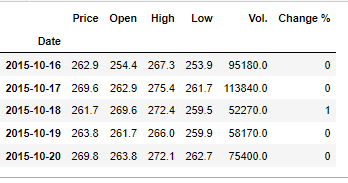
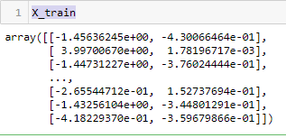
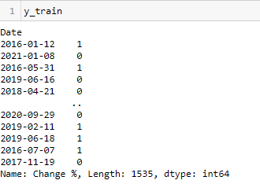
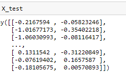
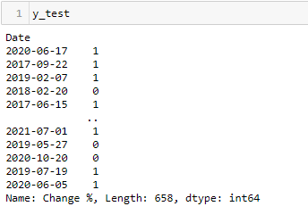
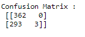

# Model Development

## Overview:
1)Importing Essential Libraries.
2)Reading Data
3)Encoding change column in 0/1
4)Scaling data
5)Performing Principal Component Analysis /Without PCA
6) Performing Hyper Parameter Tuning Using Grid Search CV
7) Model Creation and Prediction
8)Confusion Matrix/Accuracy/Precision

### Encoding
Label Encoding refers to converting the labels into a numeric form so as to convert them into the machine-readable form. Machine learning algorithms can then decide in a better way how those labels must be operated. It is an important pre-processing step for the structured dataset in supervised learning.

* Change column converted in Machine readable form i.e. 0 and 1

### Data Scaling:

Standard Scaler is an important technique that is mainly performed as a pre-processing step before many machine learning models, in order to standardize the range of functionality of the input dataset.
* Here, is a scaling data using standard scaler
            

### Principal Component Analysis

Principal Component Analysis, or PCA, is a dimensionality-reduction method that is often used to reduce the dimensionality of large data sets, by transforming a large set of variables into a smaller one that still contains most of the information in the large set.
Reducing the number of variables of a data set naturally comes at the expense of accuracy, but the trick in dimensionality reduction is to trade a little accuracy for simplicity. Because smaller data sets are easier to explore and visualize and make analysing data much easier and faster for machine learning algorithms without extraneous variables to process.
In our Model, 
* Shape of scaled data: (2193, 5)
 
* Shape of PCA data: (2193, 2)

### Train and Test data

The train-test split procedure is used to estimate the performance of machine learning algorithms when they are used to make predictions on data not used to train the model.
It is a fast and easy procedure to perform, the results of which allow you to compare the performance of machine learning algorithms for your predictive modelling problem. Although simple to use and interpret, there are times when the procedure should not be used, such as when you have a small dataset and situations where additional configuration is required, such as when it is used for classification and the dataset is not balanced.
By using Sklearn  model we train and test the data.

Here X train is:

Y train is

X test is

Y test is

### Performing Hyper parameter Tuning Using Grid Search CV

Hyper parameter tuning is the process of tuning the parameters present as the tuples while we build machine learning models. These parameters are defined by us which can be manipulated according to programmer wish. Machine learning algorithms never learn these parameters. These are tuned so that we could get good performance by the model. Hyper parameter tuning aims to find such parameters where the performance of the model is highest or where the model performance is best and the error rate is least. We define the hyper parameter as shown below for the random forest classifier model. These parameters are tuned randomly and results are checked.
Steps Followed in Hyper Parameter Tunning are Below:
* Select the type of model we want to use like Random ForestClassifier, regressor or any other model
* Check what are the parameters of the model
* Select the methods for searching the hyperparameter
* Select the cross-validation approach
* Evaluate the model using the score
* Implementation of Regression Model 

At last Conclusions are,

Logistic Regression Test Accuracy: 0.554711246200609

Decision Tree Test Accuracy: 0.47112462006079026

Random Forest Test Accuracy: 0.48024316109422494

### Implementation of Model using GridSearchCV 

The mean accuracy of the model is: 0.55319148936170

Confusion Matrix

## Implementation Without  PCA

The mean accuracy of the model Without PCA is: 

0.9954407294832827
