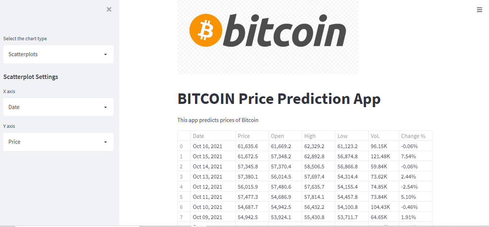
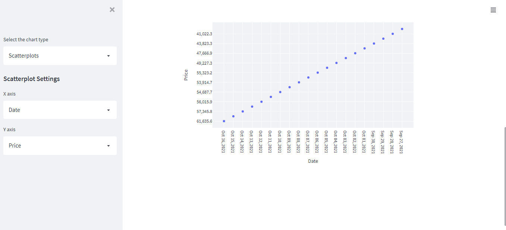
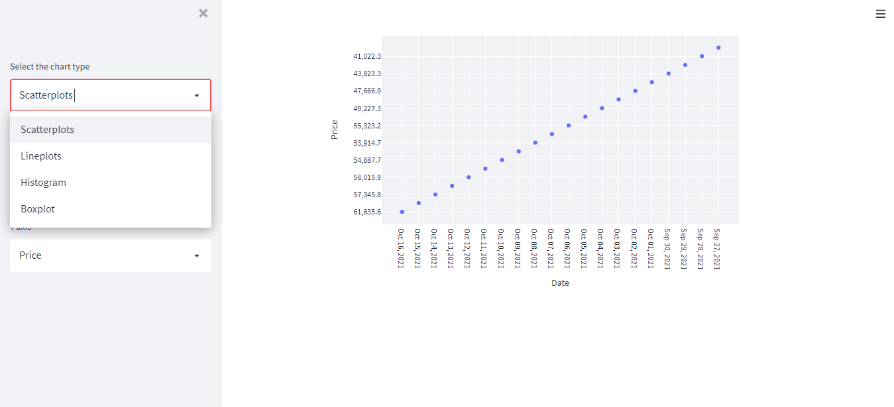

# Deployment
***
We have used **Streamlit** framework to create a webapp .

In this webapp a dataframe table is already displayed before any selection by the user, in order to give user a clear view about the all the attributes trends with one another.

In the next part, in the sidebar of the app user can select the type of plots ie scatterplot, histogram, boxplot, lineplot so that the trands of all the attributes can be viewed by the user as per his choice of x axis and y axis in settings.

Selection of type of plot / Selection of x axis and y axis

Sample plot

